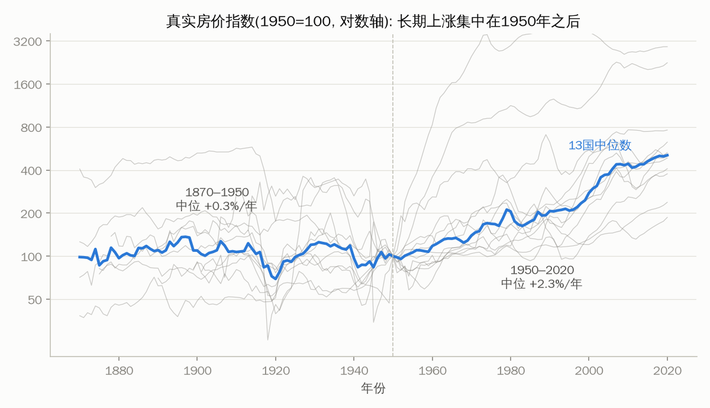
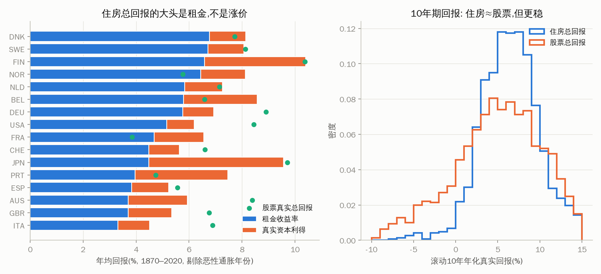
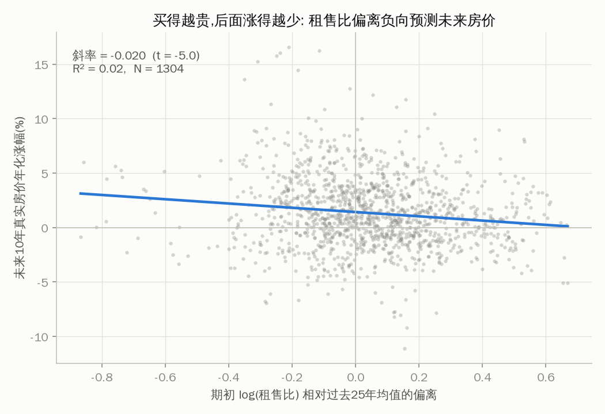
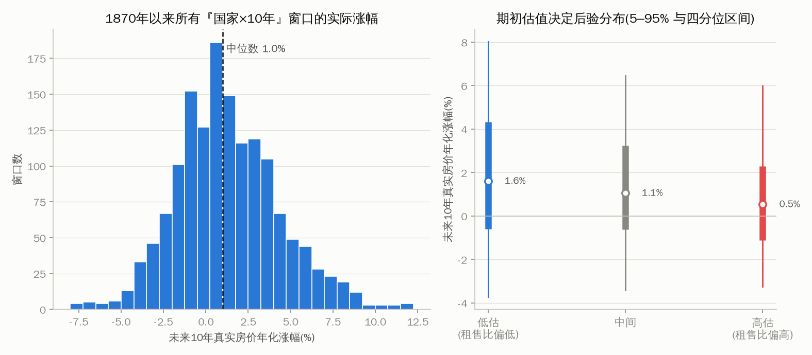
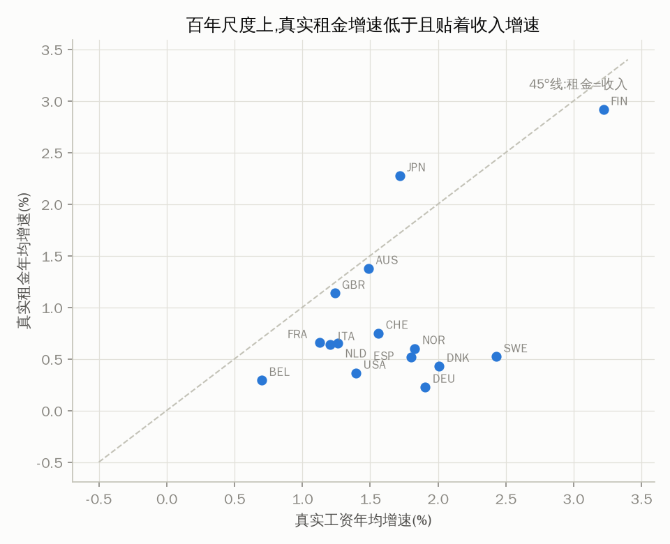
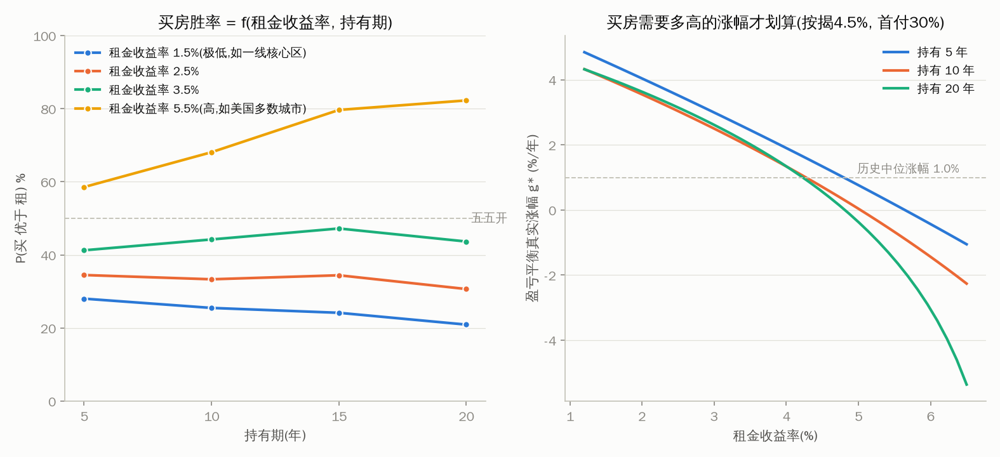
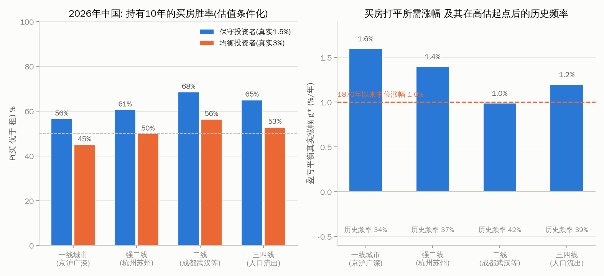

# 买房还是租房？——用 150 年跨国历史把预测题变成概率题

**初稿 · 2026-08**

## 摘要

"买房还是租房"之所以争论不休，不是因为账算不清，而是因为账里有三个未来量——房价涨速、租金涨速、替代投资收益率——没人能精确预测。本文提出一个化解办法：把决策所需变量分成三层（决策时刻可直接观察的、历史上呈均值回归因而半可预测的、不可约不确定的），用 Jordà-Schularick-Taylor 宏观历史数据库（18 国、1870–2020）为不可观察的量建立经验分布，然后把"买房是否划算"重述为两个可查证的问题：**(i) 给定你所在城市可观察的租售比、利率与成本，买房打平需要多高的真实房价年涨幅 g\*；(ii) 这个涨幅在 150 年 × 16 国的历史中出现过多大比例。** 实证部分复现并确认了六个典型事实，其中最重要的三个是：真实房价的长期涨幅很低（1870–1950 年中位数仅 +0.3%/年，1950 年后 +2.3%/年）；住房总回报约 7%/年中约五个百分点来自租金而非涨价；期初租售比偏离负向预测未来十年房价，但按重叠窗口修正后仅勉强显著（双向聚类 t=−2.08，p≈0.055；五年期 t=−1.71，不显著），解释力亦温和（R²≈2%）——这一弱预测力本身即是"输出概率而非点估计"的理由。配套算法遍历全部历史窗口生成买房胜率 P(买优于租)，并以国家为整群的自助法给每个概率配 95% 区间。案例应用显示：租金收益率 1.8%、按揭 4% 的市场，持有十年买房胜率约 20%（区间 [14, 26]）；租金收益率 5.5%、按揭 6.5% 的市场（典型的美国画像），胜率约 60%（区间 [51, 68]）；持有期短于 5 年时，交易成本使租房在几乎所有参数下胜出。针对 2026 年的中国的专门案例研究（第 8 节）显示：经过房价下跌、按揭利率降至 3.1%、居民可得投资收益率塌缩三重移动后，买租天平较 2021 年大幅回摆——二线省会成为唯一"打平只需历史平均涨幅"、金融账基本打平的画像，一线仍偏租但期望代价从 30%+ 房价缩小到约一成，三四线与"日本路径"风险需要模型之外的修正；并据此给出分城市、分年龄、分收入的建议矩阵，以及一张只含租金收益率与持有期两个因素的速查表。

---

## 1. 引言

如果有人能准确告诉你未来十年你所在城市的房价年涨幅、租金年涨幅，以及你把钱投在别处能拿到的收益率，那么"买房还是租房"就只是一道初中算术题。争论的全部来源，是这三个数没人知道。

面对不可知的量，常见的两种反应都不能令人满意。一种是假装知道——挑一个"合理假设"（比如"房价长期跑赢通胀 3 个点"）代入计算，得到一个看似精确、实则完全由假设驱动的结论。另一种是放弃计算——"看个人情况"、"丰俭由人"，把一个大部分成分可以量化的问题完全交给情绪。

本文走第三条路：**承认这三个量不可精确预测，但拒绝承认它们完全不可知。** 过去 150 年、18 个发达经济体的完整记录（房价、租金、股债回报、利率、通胀、工资）告诉我们这些量的经验分布长什么样、被什么可观察的变量所条件化。于是问题从"预测未来"降格为"查历史频率"：买房打平所需要的涨幅，在历史上出现过多少次？在当前这样的估值水平之后，又出现过多少次？

这个降格是有代价的——答案从"该买/该租"变成"买房胜率 62%"。但我们认为这正是这个问题**诚实答案的形态**。第 7 节会展示，即便只输出概率，不同城市之间的差别也大到足以指导行动。

## 2. 模型：这道算术题的精确形式

比较两条路径在持有期 $T$ 年末的净财富。两条路径每年花同样多的钱（取两者现金流出的较大值），少花的一方把差额投入替代资产——这保证比较的是"同一笔钱走两条路"，而非生活水平不同的两个人。

**买**：首付 $d \cdot P_0$，贷款 $(1-d)P_0$ 以利率 $i$ 等额本息 $n$ 年；每年付月供与持有成本（维护、物业、持有税费，合计 $c \cdot P_t$）；期初付交易成本 $\kappa_b P_0$；期末以 $P_T$ 卖出，付 $\kappa_s P_T$，清偿贷款余额。

**租**：租住同等房屋，年租金 $R_t = ry \cdot P_0 (1+g_R)^{t-1}$（$ry$ 为当前租金收益率，即租售比的倒数）；把首付、交易成本与每年买租现金流差额投入替代资产，税后年化收益 $r$。

期末财富差 $\Delta(T) = W_{买} - W_{租}$ 是房价涨幅 $g_P$ 的单调增函数。定义**盈亏平衡涨幅** $g^*$ 为使 $\Delta(T)=0$ 的 $g_P$。

这个终值比较与使用者成本框架（Poterba 1984; Himmelberg, Mayer & Sinai 2005）在一期近似下等价：买入划算当且仅当

$$ry > u \equiv i + c + \kappa/T - g_P,$$

即租金收益率超过使用者成本。终值形式的好处是精确处理杠杆、摊销、租金增长与交易成本的时间结构，并且让"锁定名义月供"这一机制显式出现——通胀上行时租金与房价的名义路径上移而月供不变，业主天然持有一份通胀对冲（Sinai & Souleles 2005 意义上的租金风险对冲）。

## 3. 变量三分法

模型输入按认识论地位分三层。这个分法是全文的方法论骨架：

**A 层——决策时刻直接可观察，无需任何预测**：当前租金收益率 $ry$（去中介网站查同小区租金即可）、按揭利率 $i$（合同锁定）、首付比例 $d$、交易成本 $\kappa_b, \kappa_s$、持有成本 $c$、以及你自己计划的持有期 $T$。

**B 层——半可预测**：未来房价涨幅部分地被期初估值条件化（第 4.3 节）；租金涨速长期贴着当地收入与通胀（第 4.5 节）；未来 20 年的购房主力人口今天已经出生。

**C 层——不可约的不确定**：替代投资收益率、通胀体制、政策冲击。只能以历史分布处理。

关键观察：**争议最大的量（房价涨幅）恰好拥有最好的可观察代理（租售比）**，这是第 4 节要建立的实证事实。

## 4. 历史证据：六个典型事实

数据为 JST Macrohistory Database R6（18 国 1870–2020 年，含 Knoll, Schularick & Steger 2017 的房价序列与 Jordà, Knoll, Kuvshinov, Schularick & Taylor 2019 的回报序列）。恶性通胀年份（|通胀|>50%）剔出回报统计。全部数字由 `analysis/stylized_facts.py` 生成，可复现。

**关于样本量的说明。** 数据库有 18 国，但不同事实建立在不同的子样本上，本文逐处标注、不含混：事实一的真实房价面板为 **13 国**（1950 年基准年可得者；1870–1950 年的中位数只有 **12 国**）；事实三、四、六与**全部算法输出**依赖租金收益率序列以构造估值偏离与滚动窗口，为 **16 国**（缺加拿大、爱尔兰）。凡称"历史频率""胜率"处，其经验基础都是这 16 国。

### 4.1 事实一：真实房价的长期涨幅很低，且集中在 1950 年之后



真实房价指数（1950=100，13 国面板）的跨国中位数，在 1870–1950 年的年化涨幅只有 **+0.3%**（该时段可得 12 国）——三代人的时间里房价基本只跟着通胀走。1950–2020 年中位涨幅升至 **+2.3%/年**，全样本 1870–2020 为 **+1.2%/年**。Knoll 等（2017）进一步显示战后上涨的约八成来自地价而非建筑。

含义有二。第一，任何"房价长期必然大幅跑赢通胀"的先验都与 1950 年前的八十年不符；战后体制（信贷自由化、土地约束、利率长期下行）是否延续，恰恰是不可知的 C 层问题。第二，即便在战后体制内，+2.3% 的中位数也远低于多数购房者的心理预期。

### 4.2 事实二：住房回报的大头是租金，不是涨价



各国 1870–2020 年均：租金收益率 **5.1%**，真实资本利得（年度算术平均）**2.0%**，住房真实总回报 **7.0%**——与股票的 **7.2%** 几乎相同（Jordà 等 2019 的核心结果）。且以滚动十年窗口衡量，住房总回报的离散度（标准差 3.8%）明显小于股票（5.8%）。

对买租决策的直接含义：**自住买房"赚"的可靠部分是省下的租金（体现为租金收益率），投机部分才是涨价。** 一个租金收益率 5% 的市场，买房不需要房价涨也划算；一个租金收益率 1.5% 的市场，买房的全部逻辑都押在涨价上。

### 4.3 事实三：租售比偏离负向预测未来房价——方向可靠，力度温和



以"log 租售比相对本国过去 25 年均值的偏离"为期初估值代理（决策时刻实时可算），对未来 10 年真实房价年化涨幅做池化回归：斜率 **−0.020**（N=1304，16 国）；5 年期斜率 −0.023（N=1421）。方向与 Gallin（2008）等文献一致：买得越贵，后面涨得越少。

**但显著性必须按重叠窗口修正后报告。** 相邻的十年窗口共享九年数据，且各国房价受同一轮全球周期驱动——朴素 OLS 把强相关的观测当独立样本，标准误被系统性低估。以聚类稳健标准误重算（`analysis/uncertainty.py`）：

| 标准误口径 | 10 年期 t | 5 年期 t |
|---|---|---|
| 朴素 OLS | −5.05 | −4.22 |
| 按国家聚类 | −2.15 | −1.79 |
| 按起始年聚类 | −3.77 | −2.97 |
| 双向聚类（国家 × 起始年） | **−2.08** | **−1.71** |

以双向聚类为准，p 值按 t(G−1)、G=16 计：**十年期 p≈0.055，五年期 p≈0.11。** 结论随之改写为：十年尺度上的均值回归勉强够到常规显著性门槛，五年尺度上与零无法区分。朴素 OLS 报出的 t≈−5 是窗口重叠制造的假象，不应作为"这个代理很可靠"的证据。

在此基础上，另一个数字同样必须诚实报告：**R² 只有约 2%。** 期初估值显著地移动未来涨幅的均值，却远远不能锁定它。这不是方法失败，而是本文的核心方法论证据——正因为最好的可观察代理也只有温和的预测力，任何输出点估计的买租计算器都在假装拥有不存在的信息；诚实的输出只能是被估值适度条件化后的**分布**。

### 4.4 事实四：未来涨幅的历史分布——算法的查询表



全部 1510 个"国家 × 10 年"窗口（16 国）中，真实房价年化涨幅的分布：

| 分位 | 5% | 25% | 50% | 75% | 95% |
|---|---|---|---|---|---|
| 年化真实涨幅 | −3.4% | −0.7% | **+1.0%** | +3.2% | +7.1% |

| 门槛(年化真实) | ≥0% | ≥1% | ≥2% | ≥3% | ≥4% | ≥5% |
|---|---|---|---|---|---|---|
| 历史频率 | 66% | 50% | 38% | 27% | 18% | 12% |
| 95% 区间 | [61, 70] | [46, 55] | [32, 43] | [22, 32] | [14, 22] | [8, 16] |

**频率本身也是估计量。** 这些比例背后只有 16 个国家，且窗口高度重叠，因此以国家为整群（block）有放回抽样重估其抽样分布，得到上表第二行的 95% 区间——宽度约 ±4–5 个百分点。本文此后凡引用这些频率，都按"十位数可读、个位数不可读"的精度使用。

按期初估值三分位条件化后分布整体平移且方向单调：低估组中位 **+1.6%**、十年下跌概率 31%（区间 [23, 39]）；高估组中位 **+0.5%**、下跌概率 **42%**（区间 [35, 48]）。但两组之间的**对比**要按同一标准报告：高估组比低估组的十年下跌概率高 **10.6 个百分点，95% 区间 [−0.8, +21.3]，单边 p≈0.03**；中位涨幅之差 +1.1 个百分点，区间 [+0.0, +2.2]，单边 p≈0.02。也就是说，估值条件化的**方向**站得住，**强度**只够支撑一次温和的先验移动，不足以支撑"高估的市场必然下跌"这类断言。

这张表就是算法的核心：它把"你认为房价会涨多少"这个无法验证的信念，换成"你需要的涨幅在历史上出现过多少次"这个可以验证的事实。

### 4.5 事实五：真实租金增速低于且贴着收入增速



各国百年尺度的真实租金年均增速平均 **+0.9%**，系统性低于真实工资增速（**+1.7%**），且所有国家都落在 45° 线下方。给租金涨速设先验时，"当地名义收入增速"是一个略偏保守方向的上界锚。这也意味着"租金会永远暴涨"与"房价会永远暴涨"一样缺乏历史支持。

### 4.6 事实六：持有期短是买方无法克服的劣势

买卖交易成本在各国合计约 5–10%。摊到持有期后：持有 3 年时即便房价与投资同速增长，租房仍稳定胜出（第 7 节案例 C）。这是整个问题中最不依赖预测的结论：**预期五年内可能搬家的人，租。**

## 5. 代理变量：问题的答案

回到本研究的出发点——"能否找到相对准确的代理变量？"。答案分两半：

**能：** 按（可观察性 × 预测力）排序的代理集为：(1) **当前租金收益率本身**——它直接决定买方现金流账的底色（事实二），是单个最重要的输入，且完全可观察；(2) **租售比相对本地历史常态的偏离**——温和地条件化未来涨幅分布（事实三、四），按重叠窗口修正后十年尺度勉强显著、五年尺度不显著，因此只应被当作先验的小幅移动而非判据；(3) **真实按揭利率**——使用者成本的最大项，合同可锁定；(4) **本地收入增速**——租金涨速的锚（事实五）；(5) **持有期**——个人变量，但其作用完全确定（事实六）。

**但有边界：** 这些代理把未来涨幅的分布移动一到两个百分点、把十年下跌概率在 31% 与 42% 之间移动，却不能把分布收窄成一个数。而且这个移动量本身也不精确：31% 与 42% 各自带着约 ±7 个百分点的区间，两者之差 10.6 个百分点的 95% 区间为 [−0.8, +21.3]。

因此代理集内部还应再分层：**第 (1)、(3)、(5) 项（租金收益率、按揭利率、持有期）可观察且作用确定，构成结论的骨架；第 (2)、(4) 项（估值偏离、收入增速）只是对分布的温和修正。** 一个只用前三项的粗糙判断，比一个把第 (2) 项当作强信号的精致判断更可靠。它们支撑的是**概率化的估算**，不是预言；试图给出更精确答案的方法，超出的部分都是假装。

## 6. 算法

```
输入   A层观察值: ry, i, d, n, κ_b, κ_s, c, T; 可选: 本市历史常态租金收益率
第1层  确定性核心    终值财富比较(第2节模型), A层精确代入
第2层  盈亏平衡      解 g*: 使买=租的房价涨幅(brentq)
第3层  历史频率      P(实际涨幅 ≥ g* | 持有期) — 查事实四的窗口表;
                     若给出本市历史常态租售比 → 按估值三分位条件化
第4层  历史全量求值  遍历同持有期(可选同估值组)的每一个历史窗口, 取
                     (g_房, g_租, r_股, r_债, 通胀) 的联合实现值代入模型
                     → P(买优于租), 财富差分布
第5层  不确定性      以国家为整群(block)有放回抽样, 给第3、4层的每个概率
                     配 95% 区间
输出   g*, 历史频率(含区间), 买房胜率(含区间), 期末财富差的90%区间
```

设计要点有三。其一，**不假设任何参数分布**：直接取真实历史窗口的**联合**实现值，因此变量间的相关结构（通胀推高名义租金与房价而月供锁定——业主的通胀对冲；股市与房市的共动）被原样保留。按揭利率不参与，因为它是合同锁定的 A 层变量。

其二，**全量而非抽样**。同持有期的窗口池只有数百到一千余个，逐个求值即得精确的胜率；从中有放回抽 5000 次只会给同一个数字添一层与数据无关的蒙特卡洛噪声。去掉这层噪声后计算也快了两个数量级（毫秒级）。

其三，**不确定性以国家为整群**。窗口高度重叠、各国又受同一轮全球周期驱动，独立样本量远小于窗口数；把整个国家作为不可分的 block 重抽，同时吸收窗口重叠与国别内相关。第 5 层输出的区间宽度是与点估计同等重要的结果：它决定了这个胜率能被读到几位有效数字。代价是 block 只有 16 个，区间本身偏保守——这是本文愿意接受的方向。

窗口内取年化常数速率，丢失路径内波动（对含杠杆路径的影响方向见第 9 节）。

第 3 层与第 4 层刻意分开输出：前者只动一个变量（房价），直观可核；后者让所有 B/C 层变量同时动。两者的差值本身有信息量——例如高租金收益率市场中全量求值的胜率（60%）高于单变量历史频率（51%），正是租金增长与通胀对冲两条被单变量分析忽略的买方优势。但两者的 95% 区间（[51, 68] 与 [46, 56]）大幅重叠，所以这个差值只宜作定性解读。



上图右格给出一个可携带的经验法则：**按揭 4.5%、首付三成时，租金收益率约 4.5% 是"买房不靠涨价也划算"的分水岭**（g\* 降到历史中位涨幅 1.0% 以下）；左格显示胜率曲面——租金收益率 5.5% 的市场持有二十年买房胜率约 82%，租金收益率 1.5% 的市场持有再久也不超过 30%。

## 7. 案例应用

三个风格化画像（`python3 -m buyrent.cli` 可复现，参数见表）：

| | A: 低租售比大城市 | B: 高租售比市场 | C: 短持有期 |
|---|---|---|---|
| 参数 | ry 1.8%（历史常态 2.2%）, 按揭 4.0%, 持有 10 年 | ry 5.5%（处于自身常态）, 按揭 6.5%, 持有 10 年 | ry 3.0%, 按揭 3.5%, 持有 3 年 |
| 盈亏平衡真实涨幅 g* | **+3.5%/年 ×10年** | **+0.9%/年** | +3.2%/年 ×3年 |
| 历史频率(无条件) | 22% [19, 26] | 51% [46, 56] | 32% [29, 35] |
| 历史频率(按估值条件化) | **15%** [9, 23]（高估组） | 52% [44, 61]（中间组） | — |
| P(买优于租) | **20%** [14, 26] | **60%** [51, 68] | 38% [34, 42] |
| 财富差中位(占房价,真实) | −32% | +9% | −5% |
| 90% 区间 | [−113%, +39%] | [−61%, +88%] | [−30%, +28%] |

方括号为 95% 区间（以国家为整群自助）。整张表由 `python3 analysis/cases.py` 生成并写入 `data/derived/cases.json`，测试锁定其与本表一致。

画像 A 接近 2020 年代中国一线城市：买房打平需要连续十年 3.5% 的真实涨幅——这在全部历史中只有约两成窗口做到过，在与当前类似的高估值起点之后约一成半。画像 B 接近美国多数都会区：买房几乎不需要涨幅就划算，胜率六成，且下行风险有限。画像 C 展示事实六：即便利率低、估值中性，三年的持有期就足以让买方在中位情形下亏掉 5% 的房价。

区间在这里正是要点：A 与 B 的胜率区间（[14, 26] 与 [51, 68]）相隔很远，**这个差别是数据能支撑的**；而 A 的 20% 与另一个 25% 的画像之间，数据支撑不了任何区分。

三个画像共同说明：**这个问题没有普适答案，但有普适算法。** 答案随两三个可观察变量剧烈移动——这正是"看情况"的精确化。

## 8. 案例研究：2026 年的中国——分城市、分人群

本节把算法完整应用于 2026 年年中的中国，参数取自公开数据（2026 年 8 月检索，来源见文末），并针对中国的制度环境做三处修正：**(i)** 租房者的替代投资收益率不再从全球历史抽样，而是固定为中国居民实际可得的水平；**(ii)** 因为中国按揭是 LPR 浮动利率（每年重定价），蒙特卡洛把窗口通胀固定在现值 0.5%——若照搬历史通胀抽样并锁定名义月供，等于凭空授予中国买方一份美式 30 年固定利率按揭独有的通胀对冲（历史窗口平均通胀约 3.5%，会把买方胜率系统性抬高约 15–20 个百分点），浮动利率下该通道必须关闭；**(iii)** 三四线城市的结果叠加人口结构与流动性的场外修正。**本节是金融账的估算，不构成投资建议；所有参数都可以在 `analysis/china_2026.py` 与 CLI 中改成你自己的数字。**

### 8.1 2026 年的输入变量

| 变量 | 2026 年取值 | 说明 |
|---|---|---|
| 按揭利率 | **3.1%**（新发放加权平均，2026Q2） | 5 年期 LPR 3.5%（2026-08 连续 15 个月未动）；公积金 5 年以上 2.6% |
| 租金收益率 | 北京 1.64 / 上海 1.95 / 广州 1.87 / 深圳 1.82（2025-11）；二线平均 **2.36**（2026-03，杭苏约 2.0，成都武汉 >2.3）；三四线约 2.2 | 较 2021 年顶部普遍修复 0.3–0.8 个百分点（房价下跌所致） |
| 市场状态 | 2026 上半年百城二手房价累跌 2.9%，跌幅收窄；沪深二手转涨，京沪成交量创五年新高 | 核心城市二手价较 2021 高点累计跌约 20–30%，市场筑底 |
| 物价与利率环境 | CPI ≈ 0；10 年期国债 **1.73%** | 名义按揭 3.1% ≈ **真实利率 3%**，并不低；租房者可得收益率：存款 ~1.3%、理财 2–2.5% |
| 交易与持有 | 契税下调后买入成本约 2.5%（含中介）；满五唯一卖出约 1.5%；无房产税，持有成本约 0.7%/年 | 首付最低 15–20%，本节按常见的 30% 计算 |

2026 年与 2021 年相比，**三个关键变量同向移动，且都朝有利于买方的方向**：房价跌了两到三成（租售比修复）、按揭利率从 5.3% 降到 3.1%、租房者能拿到的投资收益率从"理财 4–5%"塌缩到"存款国债 1 字头"。用算法量化这次移动：2021 年顶部的一线城市（租金收益率 1.5%、按揭 5.3%、租方替代收益 4.5%），买房打平需要**连续十年 +2.8% 的真实涨幅**，在高估起点后的历史频率只有 **22%**——此后房价的实际走势与这个概率相符。同样的城市在 2026 年（租金收益率 1.8%、按揭 3.1%、租方替代收益率真实 1.5%）只需要 **+1.6%**，条件频率升到 34%。**中国买租天平在五年内发生的移动，比大多数人的直觉更大。**

### 8.2 分城市结果

四类城市画像、两类租房投资者（保守型：存款/国债/理财，真实收益 1.5%；均衡型：含权益或全球配置，真实 3%），持有 10 年，估值按各城相对自身 25 年常态的偏离条件化（所有画像都落在"高估组"——即便经过大跌，中国城市的租售比仍未回到自己 2000 年代的常态）：



| 持有10年 | 一线(京沪广深) | 强二线(杭苏) | 二线(成都武汉等) | 三四线(人口流出) |
|---|---|---|---|---|
| 当前租金收益率 | 1.8% | 2.0% | 2.4% | 2.2% |
| 盈亏平衡真实涨幅 g* | +1.6%/年 | +1.4%/年 | **+1.0%/年** | +1.2%/年 |
| 历史频率(高估组条件化) | 34% [26, 43] | 37% [29, 45] | 42% [35, 50] | 39% [32, 47]* |
| P(买优于租)·保守投资者 | 36% [28, 45] | 39% [32, 48] | **46% [39, 54]** | 44% [37, 51]* |
| P(买优于租)·均衡投资者 | 26% [18, 35] | 29% [21, 38] | 37% [28, 46] | 32% [23, 40]* |
| 财富差中位(保守, 占房价) | −10% | −7% | **−2%** | −5%* |
| 90% 区间(保守) | [−43%, +60%] | [−41%, +62%] | [−37%, +67%] | [−39%, +65%]* |

*三四线数字失真，见下文场外修正。方括号为 95% 区间（以国家为整群自助）。

**读表须知：相邻城市档之间的区间大幅重叠。** 一线 36% [28, 45] 与二线 46% [39, 54] 的区间有交集，强二线与二线几乎完全重叠。因此本表支持的是**梯度**（租金收益率越高越偏买，四档单调）而不是**排序**（不能说"强二线一定比一线好"）。能被数据分开的，是两端；中间三档之间的差别，在 16 个国家的历史样本上分不开。

三点解读：

**第一，两条独立的路到达相近的答案，这本身增加了可信度。** 历史频率层（只动房价一个变量，租金真实零增长）给出 34%–42%；全量求值层（房价与租金取联合实现值、投资收益率取保守/均衡两档）给出 26%–46%。所有城市、所有口径都落在 50% 以下——**2026 年在中国买房的金融账仍然偏租，但已远离 2021 年的一边倒**（2021 年顶部的一线城市约两成）。若中国未来改用固定利率按揭且通胀回升，买方将获得本文对美式市场保留的那份通胀对冲，数字整体上移。

**第二，二线省会最接近打平，且是唯一"不赌涨价"的画像。** 成都、武汉档的租金收益率（2.4%)对上 3.1% 的按揭，盈亏平衡涨幅恰好落在 1870 年以来的历史中位数（+1.0%）上——买房打平只要求"房价表现达到历史平均水平"，这是四类城市中唯一不需要跑赢历史的；其买房胜率 46%（区间 [39, 54]，是四档中唯一区间上沿越过 50% 的）、财富差中位仅 −2% 房价，即金融账基本打平。确定性压力表同样显示：二线在"真实涨幅 +1%"路径下恰好打平，横盘十年亏 10% 房价；一线横盘十年亏 17%，日本路径（−2%/年）亏 36%。

**第三，模型对三四线给出的 44% 仍是系统性高估，应当场外下修。** 模型假设期末能以市价、以 1.5% 成本卖出——这在人口流出城市不成立（挂牌数年无成交、实际折价远超模型的卖出成本）。把卖出成本提到 5% 后，三四线横盘十年亏 16% 房价、日本路径亏 34%。更重要的是日本参照（下段）。三四线的房子应当按**耐用消费品**估值——"这个价格买来住二十年，转售价值按零或残值计，还合算吗"——而不是按资产估值。

**日本参照——估值信号会被体制切换压倒。** 本文数据中的日本：1990 年起的十年，真实房价年化 **−2.2%**；1995 年起 **−3.6%**；最刺目的是 2000 年——按估值已落入"低估组"——其后十年仍是 **−3.2%**。人口下行叠加通缩的体制里，均值回归信号连续失效二十年。中国 2026 与日本 1992–94 的相似处（总人口连续负增长、通缩压力、高库存、居民资产负债表修复）与不同处（核心城市已先跌 20–30% 而日本当年从未主动挤泡沫、城镇化与户籍改革仍有余量、按揭利率已在低位）都摆在明面上。本文不裁决中国走哪条路径；本文的贡献是把两条路径的后果都算出来：**历史中位路径下，2026 年在中国多数城市买房是接近打平或小赚的；日本路径下，任何城市买房都亏掉三成上下的房价。** 你对"中国是不是日本"的判断，就是你的答案里最大的那个变量。

### 8.3 分人群建议

以下建议全部由上表的金融账推导，非金融因素（学区、户口、稳定感、装修自由）作为方向性修正标注。先立四条与城市无关的红线，再分人群：

**红线（任何年龄、任何城市、任何收入）：**
1. **预期持有期不足 5 年，不买。**交易成本摊薄在任何参数组合下都压倒其他变量（第 4.6 节）。工作地未定、行业动荡、可能离开当前城市的人，这一条就是全部答案。
2. **月供超过税后收入 40%，不买。**概率化的账算的是"平均能赢"，但月供是每个月都要赢的账；被迫中途卖出会把 90% 区间的左尾（−30% 到 −40% 房价）变成现实。
3. **掏空六个月应急储备去凑首付，不买。**理由同上：买房最大的个体风险不是房价，是被迫在坏时点卖出。
4. **只买现房或二手，不碰高风险期房。**2026 年的交付风险仍未出清，期房折价买的是开发商的信用，不是房子。

**25–35 岁、居住城市未定（流动期）：默认租。** 这个阶段的核心资产是职业选择权，持有期不确定直接触发红线 1。特别对一线城市的年轻人：2026 年的租金是被量化验证的便宜——月供是同等房屋租金的 **2.0 倍**（房价 100 的房子年租 1.8、年供 3.6），房东收着 1.8% 的租金收益率对着 3.1% 的按揭利率，**是房东在补贴租客，不是租客在帮房东打工**。租房+定投攒首付在金融账上严格占优，直到你的持有期确定为止。

**30–45 岁、定居城市已定（家庭形成期）——分城市：**
- **二线省会（成都武汉档，租金收益率 ≥2.3%）：可以买。**这是全表唯一"打平只需历史平均涨幅"的画像，金融账基本打平（胜率 46%，区间 [39, 54]；财富差中位 −2% 房价），且下行压力情形（横盘亏 10%）在有稳定收入的家庭承受范围内。定居确定+持有 10 年以上+月供合规，金融账不再构成反对理由。
- **一线与强二线：金融账仍偏租（胜率 27%–39%），但代价已缩小到可以被非金融因素合理买断。**2021 年买房的期望代价是 30%+ 房价，金融账一边倒；2026 年缩小到中位约 7%–9% 房价（十年）——想要学区、户口捆绑的公共服务、"不被房东赶"的稳定感的家庭，现在为这些东西支付的是一个可承受的、可量化的价格，是否值得由各家自己定。但买之前用压力表自检：日本路径下亏 36% 房价（对首付三成的家庭即是**净值腰斩以上**）——问自己能否承受而不影响生活，答案为否则继续租。
- **三四线（人口流出）：自住按耐用消费品逻辑，投资逻辑不存在。**房价便宜到"买来住二十年、残值归零也比租便宜"的（小城市大量存在这种价格），买；否则租——人口流出城市的租金会越来越便宜，租方几乎没有"被涨租赶走"的风险。

**45–60 岁（财富配置期）：问题从"买不买"变成"仓位"。** 中国城镇家庭资产约六到七成已在房产。这个阶段的正确问题是：(i) **不加仓**——第二套投资房的账（租金收益率 2.0–2.4%，对比无风险的 1.73% 国债，价差补偿不了空置、折旧、流动性与集中度风险）在 2026 年仍然不成立；(ii) **置换可以做**——跌市中卖旧买新的价差是友好的，改善居住是消费不是投资；(iii) **考虑减仓**——多套房家庭利用核心城市成交回暖的窗口把最差流动性的那套变现，是本节所有建议中确定性最高的一条。
**60 岁以上：不新增任何房产杠杆。**居住优先大城市核心区（流动性最好、医疗可及），多余房产的处置宜早不宜晚——接盘你房子的 25–45 岁人口，未来二十年每年都比今年少。

**收入维度的修正**：低收入家庭（月供占比触红线 2）在任何城市都先租——为了"上车"把远郊新房当替代品是最差选择，它同时踩中流动性差、通勤成本、期房风险三个坑；确实要买，选通勤圈内的二手小户型。高收入家庭的金融账结论不变，只是数字占净值的比例小，非金融因素的权重相应放大；唯一提醒是集中度——年收入的十倍以上压在单一城市的单一资产上，是任何组合理论都不会推荐的配置，无论胜率是 45% 还是 68%。

**一句话矩阵：**

| | 一线/强二线 | 二线省会 | 三四线 |
|---|---|---|---|
| 25–35 流动期 | **租**（房东在补贴你） | 租，除非定居已定 | 租 |
| 30–45 定居期 | 金融账偏租（代价约一成房价）；非金融因素强且压力自检过再买 | **可买**（唯一不赌涨价、金融账打平的画像） | 按消费品逻辑：便宜就买，不便宜就租 |
| 45–60 配置期 | 不加仓；置换可做 | 不加仓；置换可做 | **减仓** |
| 60+ | 核心区自住，余房早处置 | 同左 | 同左 |

### 8.4 二因素速查表：查你自己的格子

前文的全部机器可以压缩成一张两维的表——**纵轴是你所在城市的租金收益率（年租金÷房价，中介网站查同小区即得），横轴是你预期的持有年数**。为什么恰好这两个因素够用？因为"影响大"和"值得当轴"是两回事，一个因素值得当表格的轴，必须既影响大、又**在读者之间差异大**。逐个检验（基准：二线画像，g\* 对各因素的敏感度）：

| 因素 | 对 g\* 的影响 | 2026 年读者之间的差异 | 处理方式 |
|---|---|---|---|
| 租金收益率 | 每 1pp 移动 g\* 约 −1.1pp | 跨城市 1.5%–5%+，差 3.5pp 以上 | **表格纵轴** |
| 持有期 | 10→5 年 +0.4pp；10→20 年 −0.3pp | 因人 3–20 年不等 | **表格横轴** |
| 按揭利率 | 每 1pp 移动 g\* 约 **+0.64pp**（影响最大的单一变量之一） | 全国 LPR 统一定价，人与人只差约 ±0.15pp | 当作常数（3.1%）进入表格前提；LPR 变动超过 ±0.5pp 时表格作废重算 |
| 租方投资收益率 | 每 1pp 移动 g\* 约 +0.47pp | 因人而异且难以自知 | **稳健带**：每格对真实 1.5% 与 3% 两档同时计算，两档同向才给结论 |
| 工资/租金涨幅 | 每 1pp 只移动 g\* 约 −0.11pp（租金基数仅为房价的 2% 上下） | 城市间约 ±1pp | 影响量级小；且已由蒙特卡洛联合抽样覆盖。工资另经"月供 ≤40%"红线起作用 |

所以答案是：**按揭利率极其重要，但它此刻对所有中国读者几乎是同一个数，所以它是表格的前提而不是表格的轴；投资收益率重要且因人而异，但用"两档都成立才下结论"消化掉了——这正是表中"中性"带偏宽的原因；工资涨幅的影响确实小。** 下表每格给出（保守投资者胜率/均衡投资者胜率）与稳健判定，其余参数同 8.1 节（按揭 3.1% 浮动、首付三成、中国成本结构、持有 10 年口径的通胀 0.5%）：

| 年租金÷房价 | 2026 年参照 | 持有3年 | 5年 | 10年 | 15年 | 20年 |
|---|---|---|---|---|---|---|
| ≤1.5% | 一线核心区、深圳部分板块 | **租** (36/31) | **租** (41/36) | **租** (40/33) | **租** (44/30) | **租** (44/28) |
| 2.0% | 京沪均值、杭州苏州 | **租** (40/35) | 中性 (46/40) | 中性 (47/38) | 中性 (52/39) | 中性 (53/37) |
| 2.5% | 成都武汉档二线 | 中性 (45/40) | 中性 (51/45) | 中性 (54/45) | 中性 (61/48) | 中性 (65/47) |
| 3.0% | 少数高收益率城区/县域 | 中性 (50/45) | 中性 (56/50) | 中性 (63/52) | **买** (71/57) | **买** (78/58) |
| 4.0% | 美国多数都会区 | **买** (60/55) | **买** (66/61) | **买** (78/69) | **买** (85/79) | **买** (91/83) |
| ≥5.0% | 高租金收益率海外市场 | **买** (71/66) | **买** (75/72) | **买** (88/84) | **买** (94/90) | **买** (96/93) |

格内数字的 95% 区间约 ±7 个百分点（以国家为整群自助），因此**判定边界上的格子不必当真**：55%/45% 的门槛落在区间之内，"中性"与相邻的"买/租"之间没有硬边界。表格能可靠区分的是两端——≤1.5% 行与 ≥4.0% 行的差别远大于任何区间宽度；中间三行的精确名次不可读。这也是把判定设成三档而非连续分数的原因。

读表规则：**"中性"不是"随便"，而是"金融账不裁决"**——胜率落在四六开之间，买与租的期望差不超过一成房价，此时应由非金融因素（学区、户口、稳定感 vs 流动性）与压力自检（日本路径下的净值损失能否承受）定夺。第 8.3 节的四条红线优先于本表：触红线者直接"租"，不必查表。表格失效条件：按揭利率相对 3.1% 变动超过 ±0.5 个百分点、开征持有环节房产税（每 1% 税率约等价于把你所在的行上移一行）、或你所在城市人口快速流出（下修一档，即"买"读作"中性"、"中性"读作"租"）。

## 9. 局限

1. **体制依赖（可切换，且已检验）。** 历史分布混合了金本位、战争管制、战后信贷扩张与低利率时代，1950 年后那轮利率长下行的一次性重估不可重演。算法支持限定样本期（`History(since=1950)`，命令行 `--since 1950`），本文默认全样本以保守为先。

   切换的后果不必猜，已经算出来了。只用战后窗口时，**无条件**频率整体右移约 7 个百分点（画像 A：22%→29%）；但**按估值条件化之后，高估组几乎不动**——画像 A 的买房胜率 20%→21%，第 8 节四类中国城市（全部落在高估组）为 **−1.2 到 −1.5 个百分点**，即战后样本反而略微更不利于买方。体制效应在中、低估值组则确实存在：画像 B 的胜率 60%→68%，画像 C 38%→48%。

   于是有一个便利的结论：**本文最依赖的那类判断——高估值市场买房不划算——对样本期的选择不敏感；反倒是那些对买方有利的判断，部分依赖战后体制的延续。** 这个方向上的不对称让默认取全样本的保守选择代价很小。
2. **窗口重叠（已修正，但不彻底）。** 滚动窗口高度重叠，独立样本量远小于名义 N。本文的处理：回归显著性以双向聚类标准误报告（第 4.3 节，t 从 −5.05 降到 −2.08），全部频率与胜率以国家为整群的自助法配 95% 区间（第 4.4、6 节）。残余问题有二：block 只有 16 个国家，自助分布自身噪声不小；整群法假定国家之间独立，而全球房价周期违反这一假定——因此真实区间只会比本文报告的更宽，不会更窄。
3. **年化常数近似。** 蒙特卡洛以窗口年化速率代替路径，低估了含杠杆买方的中途破产/被迫卖出风险与再融资选择权，两者方向相反，净效应未定。
4. **测度。** 历史租金序列平滑、品质调整不完全（JST 已作处理）；跨国房价指数口径差异。

5. **买的是一套房，不是全国指数。** JST 的房价是全国指数，而个人承担的是单套住宅相对指数的特异性波动，后者远大于指数本身，且完全不在窗口数据里。算法提供开关（`run(..., idio_sd=)`，命令行 `--idio-sd`），但本文**不估计**这个波动率——全国指数估不出它，使用者应以本地重复销售证据自行设定。把它开到年化 0%–15%：

   | 特异性年波动率 | 0% | 5% | 10% | 15% |
   |---|---|---|---|---|
   | 画像 A 胜率 | 20% | 23% | 27% | **31%** |
   | 画像 A 财富差中位 | −32% | −32% | −32% | **−32%** |
   | 画像 A 财富差 5% 分位 | −113% | −114% | −118% | **−124%** |
   | 画像 B 胜率 | 60% | 60% | 60% | 59% |
   | 画像 B 财富差 5% 分位 | −61% | −62% | −67% | −73% |

   结果与直觉相反，也因此值得单列：特异性风险**并不**系统性利好租房。它把胜率拉向五五开——画像 A 的胜率从 20% 升到 31%——而**财富差中位数纹丝不动（−32%）**，左尾则明显变厚（−113%→−124%）。胜率的上升完全来自离散度，不来自期望的改善。

   这暴露了 P(买优于租) 作为决策统计量的一个缺陷：**在一个期望明确为负的市场里，加大不确定性会让胜率变好看。** 在高估值市场买一套房，赢面上升的方式和买彩票一样。这正是本文始终把财富差的中位数与 90% 区间与胜率并列输出、而不单报胜率的原因；对使用杠杆的家庭，可承受的左尾比赢面更重要。
6. **未定价因素。** 居住稳定性、搬迁选择权、强制储蓄的行为学价值、学区等捆绑品、负资产下的心理成本——本文只算金融账，这些项的符号因人而异，应作为对概率输出的个人化修正，而非借口无视金融账。
7. **中国参数的制度调整。** 第 8 节已做初步本地化（固定租方可得收益率、无房产税的持有成本、中国交易成本结构），但 70 年使用权的续期规则、房产税的开征时点与税率仍是悬置的 C 层变量——房产税每 1% 的税率大约等价于把租金收益率永久下调 1 个百分点，足以翻转第 8.2 节的多数结论，读者应自行跟踪。三四线城市的流动性风险只做了场外定性修正，未进入模型。

## 10. 结论

买房还是租房是一道算术题，但其中三个变量属于未来。本文的贡献是给出一个不假装知道未来的算法：可观察的量精确代入，半可预测的量用估值条件化，不可知的量用 150 年跨国历史的经验分布代言，最终输出买房胜率与财富差分布。实证部分确认：住房长期回报的主体是租金而非涨价；真实房价长期涨幅的历史中位数只有约 1%/年；期初租售比是方向可靠但力度温和的预测变量。

对个体读者，结论可以压缩成三句话：**先查你所在城市的租金收益率——它决定了你买房是在收租还是在赌涨价；再用本文算法算出你需要的涨幅在历史上的出现频率——让 150 年的数据代替你对未来的信心喊话；持有期不足五年就不要买。** 其余的，是概率。

而"概率"这个词要落实到位：本文输出的胜率带着 ±5–8 个百分点的 95% 区间，只能读到十位数。20% 与 60% 之间的差别是数据能支撑的，20% 与 25% 之间的差别不是。一个诚实的买租工具，不仅要拒绝给出点估计的涨幅预测，也要拒绝假装自己的概率精确到个位。

---

## 参考文献

- Campbell, S., M. Davis, J. Gallin, and R. Martin (2009). "What Moves Housing Markets: A Variance Decomposition of the Rent-Price Ratio." *Journal of Urban Economics* 66(2).
- Gallin, J. (2008). "The Long-Run Relationship between House Prices and Rents." *Real Estate Economics* 36(4).
- Himmelberg, C., C. Mayer, and T. Sinai (2005). "Assessing High House Prices: Bubbles, Fundamentals and Misperceptions." *Journal of Economic Perspectives* 19(4).
- Jordà, Ò., K. Knoll, D. Kuvshinov, M. Schularick, and A. M. Taylor (2019). "The Rate of Return on Everything, 1870–2015." *Quarterly Journal of Economics* 134(3).
- Jordà, Ò., M. Schularick, and A. M. Taylor (2017). "Macrofinancial History and the New Business Cycle Facts." *NBER Macroeconomics Annual* 31.
- Knoll, K., M. Schularick, and T. Steger (2017). "No Price Like Home: Global House Prices, 1870–2012." *American Economic Review* 107(2).
- Mankiw, N. G., and D. Weil (1989). "The Baby Boom, the Baby Bust, and the Housing Market." *Regional Science and Urban Economics* 19(2).
- Poterba, J. (1984). "Tax Subsidies to Owner-Occupied Housing: An Asset-Market Approach." *Quarterly Journal of Economics* 99(4).
- Saiz, A. (2010). "The Geographic Determinants of Housing Supply." *Quarterly Journal of Economics* 125(3).
- Sinai, T., and N. Souleles (2005). "Owner-Occupied Housing as a Hedge Against Rent Risk." *Quarterly Journal of Economics* 120(2).

### 第 8 节 2026 年中国数据来源（2026 年 8 月检索）

- LPR 与房贷利率：[新华社/中国政府网：2026-08-20 LPR 维持不变（1 年期 3.0%、5 年期以上 3.5%）](https://english.www.gov.cn/archive/statistics/202608/20/content_WS6a8692ecc6d00ca5f9a0cb78.html)；[人民日报海外版：房贷利率又迎下调（存量公积金利率 2026-01-01 起下调，5 年以上首套 2.6%）](https://paper.people.com.cn/rmrbhwb/pc/content/202601/08/content_30130383.html)；[CEIC：个人住房贷款加权平均利率（2026 年 3 月 3.06%）](https://www.ceicdata.com/en/china/rediscount-and-lending-rate/cn-lending-rate-weighted-average-individual-housing-loan)
- 租金收益率与租售比：[证券时报：一线城市住宅平均租金由跌转涨，50 城住宅平均租售比回升（京沪广深 1.64%/1.95%/1.87%/1.82%，二线 2.36%）](https://www.stcn.com/article/detail/3920236.html)；[知乎专栏：2026 年中国租售比与收入比讨论](https://zhuanlan.zhihu.com/p/2028178204276303206)
- 房价走势：[中指研究院：2026 上半年中国房地产市场总结与下半年趋势展望（百城二手累跌 2.9%、核心城市企稳）](https://www.cih-index.com/news/2026-07-09/54872544.html)
- 利率环境：[CEIC：中国 10 年期国债收益率（2026-07 约 1.73%）](https://www.ceicdata.com/zh-hans/china/pbc--ccdc-treasury-bond-and-other-bond-yield-daily/bond-yield-treasury-bond-10-year)；[北大国发院：促进物价合理回升——货币政策的困境（低通胀下真实利率偏高）](https://www.nsd.pku.edu.cn/docs/2025-12/50c5191a9ca842f88079c50135535aa4.pdf)
